<div align="center">


<br/>

[](https://www.linkedin.com/in/negraowalker)
[](https://github.com/NegraoWalker)

<br/>


<br/>



</div>

---

## 👨‍💻 SOBRE MIM

```java
public class Walker {

    String localizacao  = "LONDRINA - PR, BRASIL 🇧🇷";
    String foco         = "DESENVOLVIMENTO BACKEND";
    String[] linguagens = {"Java", "JavaScript"};

    String[] estudando  = {
        "Node.js", "React", "Next.js",
        "Docker", "Kubernetes"
    };

    String apaixonado = "RESOLVER PROBLEMAS COM CÓDIGO ☕";
}
```

---

## 🛠️ TECNOLOGIAS

<div align="center">

### ⚙️ BACKEND — DOMÍNIO ATUAL
<br/>


### 🎨 FRONTEND — DOMÍNIO ATUAL
<br/>


### 🗄️ BANCO DE DADOS
<br/>


</div>

---

## 📚 EM APRENDIZADO

> *"O APRENDIZADO NUNCA ESGOTA A MENTE." — LEONARDO DA VINCI*

<div align="center">


</div>

---

## 🎯 PRÓXIMOS OBJETIVOS

<div align="center">

| 🎨 FRONTEND | ☁️ CLOUD & INFRA | 🗄️ BANCO DE DADOS |
|:-----------:|:----------------:|:-----------------:|
|  |  |  |
|  |  | |
|  | | |

</div>

---

## 📊 GITHUB STATS

<div align="center">

[](https://git.io/streak-stats)

</div>

---

<div align="center">


<br/><br/>


</div>